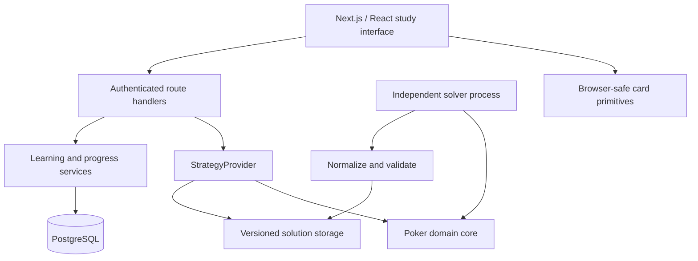

# Architecture

Rangeform is a personal poker learning application with a path to a hosted SaaS. Study Engine v2 extends the existing NLHE preflop loop into configurable heads-up flop/turn/river study. Original APPROXIMATED policies provide the initial study data; they are not equilibrium solutions. The independently computed Kuhn solution remains an internal regression.

## Study Engine v2

`domain/study.ts` deterministically replays a `StudySpot`: six-max positions, two live players, equal effective stacks, explicit open/3-bet/4-bet configuration, two Hero cards and an ordered event log. Money uses integer 1/10,000 BB units. Domain validation owns street closure, legal turn order, minimum raises and all-ins; UI cannot supply a pot or override the active player. Dead blinds from folded seats remain in the pot. Terminal study nodes retain the ledger for inspection.

`ApproximationProvider` and `StaticSolutionProvider` reuse the generic StrategyProvider contract. Approximation multiplies reached combo weights by the selected action's policy and removes dealt cards. Concrete Hero cards filter the opponent view; range-vs-range equity retains both unknown hole-card distributions and rejects collisions during sampling. Source-derived immutable versions cover state, features, sizing and policy rules. Static nodes are owned copies with provenance and legality checks; no static solver dataset is bundled.

`domain/equity.ts` is a showdown evaluator and enumerator/sampler, separate from policy. Hand-vs-hand is exact; weighted range comparisons report seed, sample count and standard error. This does not calculate action EV, future folds or equilibrium. Hand and range features live in `analysis.ts` and `range-analysis.ts`.

`/api/study` recomputes state on the server and preserves existing session/origin/rate protection. Saved spots and feedback belong to the authenticated user. Training snapshots are stored when each question is created; public unanswered questions omit frequencies. Retry identifiers and SQL uniqueness prevent duplicate decisions. Full-hand mode follows supported opponent actions to Hero; street mode restarts at the configured street boundary. Unsupported zero-reach continuations start a new supported hand. Account deletion cascades through the new tables; export includes questions, snapshots, decisions and saved spots.

Migrations 006/007 are additive and run through the existing PostgreSQL/PGlite migration mechanism. No hosting provider, secrets, commercial dependency or paid compute is added. Source tracing in Next includes the files used for immutable strategy identities. Details and limits: [decision 0004](decisions/0004-study-engine-v2.md).

## Boundaries

`src/domain` contains deterministic card and game rules without framework dependencies. `src/solver` performs computation outside the request path. `src/strategy` defines lookup and artifact validation, independent of UI and persistence. `src/server` owns authentication, SQL persistence, learning services and request policy. Route handlers are thin transport adapters. `src/shared/contracts.ts` is the public browser-safe response contract. Browser components receive training questions without solver answers; the server evaluates decisions.

## Technology decisions

- Next.js App Router, React, strict TypeScript. Native CSS tokens and self-hosted Manrope avoid runtime font and UI-service dependencies.
- PostgreSQL SQL migrations and the `pg` driver for hosted environments. For an immediately runnable single-user development setup without Docker, PGlite runs the PostgreSQL engine in-process and persists to `.data/postgres`. Production requires `DATABASE_URL`; an explicit local-preview override is not a supported hosted architecture.
- Local immutable JSON artifacts for the small initial solution. Store source, algorithm version, rules/configuration hashes, iterations and independently measured exploitability. A storage adapter boundary allows S3-compatible storage later.
- No Redis or paid queue in the initial milestone. The bounded solver is a separate CLI process; durable jobs and worker states are separate from the web interface. Hosted orchestration requires a lease-based worker queue before running paid/on-demand jobs.
- Vitest for domain, solver and SQL/service integration. Playwright and axe for complete browser flows, semantic accessibility and responsive screenshots.

## Data model

Users have stable UUID identities, unique normalized email, password verifier, display name, experience and weekly study goal. Sessions hold a hash of a high-entropy bearer token and expiry, never its plaintext value. Lesson completion belongs to a user and lesson, with uniqueness preventing duplicate rewards. Training decisions belong to a user and immutable solution version; attempt identifiers make retries idempotent. Dashboard aggregates are derived from stored records rather than client counters. Rate-limit state is durable and bounded. See SQL migrations for the implemented fields and constraints; do not treat this description as a replacement for them.

The long-term model adds courses/modules/chapters, lesson revisions, versioned trainer spots, solution/node indexes, solver jobs, subscriptions, feature flags and recommendation history. Those additions are intentionally not represented by empty screens in this release.

Local access now uses a real seeded development account, never a bypass. The account carries a database flag that excludes it from production authentication and sessions. A small fixed Academy course links to the existing original lesson, with stable course/lesson URLs. A trainer session has explicit start and completion screens; its answered decisions are persisted immediately. NLHE session context, up to ten generated questions, feedback and explicit completion are persisted in PostgreSQL. Reload resumes the same question/feedback. Immutable full-range snapshots and the flop opponent snapshot preserve session semantics across library updates.

`scripts/local-db.ts` provides local setup, migrations, idempotent seed and explicit reset. It loads the same development environment files as Next.js and refuses production or `DATABASE_URL`. A process lock prevents the local CLI and web app from opening the same PGlite directory together. Hosted PostgreSQL remains separate.

## Security and deployment boundaries

Session cookies are HttpOnly with SameSite policy and Secure over production HTTPS. Server authorization and same-origin checks protect writes. Password hashing is scrypt with individual salts. Queries use parameters; inputs are validated and bounded. Account data is private and never included in source control. Account export/deletion support personal data control. There are no trackers, payment requests, real-money tables or gambling referrals.

The host must supply HTTPS, a single canonical origin, database TLS, backups and operational monitoring. Production error collection is a deployment requirement, not a fictional integration. Health responses distinguish actual checks from unconfigured services. See `operations.md` and the status document for readiness limits.

## Future scaling path

Web app → node-scoped Strategy API → cache keyed by solution ID/version/node → object storage. PostgreSQL keeps metadata and indexes, not billions of strategy rows. Workers claim durable queue jobs, compute on separate CPU/GPU infrastructure, validate convergence and artifact integrity, then publish immutable versions atomically. Compression and binary formats must be chosen using representative benchmarks. Never load an entire industrial solution to answer one node request; the small Kuhn artifact is deliberately bounded to twelve information sets.

## Sources checked for implementation

- [Next.js installation and App Router documentation](https://nextjs.org/docs/app/getting-started/installation)
- [PGlite persistence and supported filesystems](https://pglite.dev/docs/filesystems)

Accessed 2026-09-06. Versions are locked in `pnpm-lock.yaml`.

## NLHE boundary

`src/domain/holdem.ts` supplies six-seat integer-chip betting, blinds, all-ins, street progression, best-five evaluation, side pots and chip conservation. The browser-safe cards module enumerates 52 cards, 1,326 combos and 169 classes with blockers. `StrategyProvider` is generic with Kuhn defaults retained; `NlheStrategyProvider` implements the same abstraction with NLHE configuration and action types. `scripts/nlhe.ts` publishes hashed original policy parameters, checksums the relevant source, and validates all 386 preset contexts before updating the index. Server decisions use the provider data, never client-supplied frequencies. The trainer samples physical combos weighted by prior reach; it does not sample classes uniformly. See decision 0003 for assumptions and unmeasured accuracy.

Hosted staging uses the same application with managed PostgreSQL and invitation-only signup. Local setup never reads or creates hosted accounts. `/api/live` is a database-free host probe; `/api/health` checks actual database and NLHE provider readiness.

## MTT V3 verification boundary (2026-09-12)

Public NLHE context/replay lives in domain/strategy-context.ts and domain/tournament-state.ts. The original six-max Cash engine remains independent. Context schema v2 binds every seat stack, forced-bet rules, rake, future evaluation state, full public action/deal history and blocker set. It preserves chip vectors; scalar effective stack is display-only.

solver/verified-solution.ts performs structural validation and cannot grant VERIFIED. verification/exact-best-response.ts independently evaluates bounded finite games, with no solver traversal or payoff imports. server/verification-policy.ts owns versioned approval policy. server/verify-solution.ts is the publication trust boundary: it currently rejects all NLHE because no audited adapter, calibrated model policy or licensed dataset exists. No artifact metadata or serialized status flag can authorize training.

Migration 009 preserves and quarantines historical uncertified artifacts. The conditional river path below now atomically stores an independent report with exact strategy/context/model/tree/policy identities; the Phase-1 metadata-only publisher remains removed. Generic finite-game mathematical tests are never loaded as NLHE artifacts. See qa/mtt-trust-review.md.

## Independently verified conditional river path

`domain/river-definition.ts` fixes the public context, weighted conditional root
ranges and tree identity. Context v2 binds normalized physical range distributions
for every live seat. These are study inputs, not solved ancestry.

`solver/river-model.ts` creates a complete physical-deal tree and generator
projection with the direct seven-card evaluator. `scripts/solve-river-lp.py`
executes pinned SciPy/HiGHS security LPs; `scripts/solve-river.py` separately
integrates the pinned MIT DCFR reference. `verification/river-best-response.ts`
does not consume generator payoffs: it reconstructs commitments, enumerates
five-card evaluations, calculates complete information-set best responses and
recomputes every combo EV/reach. The generic verifier also has a bounded
counterfactual dynamic algorithm cross-checked with exhaustive pure policies.

Policy v3-river1 permits only this context/model/source/license with calibrated
bounds and a numerical allowance. `solution-registry.ts` atomically persists an
approved artifact/report/job and independently rechecks exact lookups.
`VerifiedStrategyProvider` implements the existing generic provider contract with
NLHE types. No preflop fallback or imported approval exists.

Migration 010 stores user-owned version-bound training questions, responses and
feedback. `server/verified-training.ts` samples only solved support, grades EV
regret or recall distance, and derives mastery/review dates from saved history.
User deletion cascades; exports include the new data. `/mtt/river` keeps verifier
and solver dependencies out of client bundles with type-only contracts and
authenticated APIs. See [executed evidence](qa/verified-river.md).
