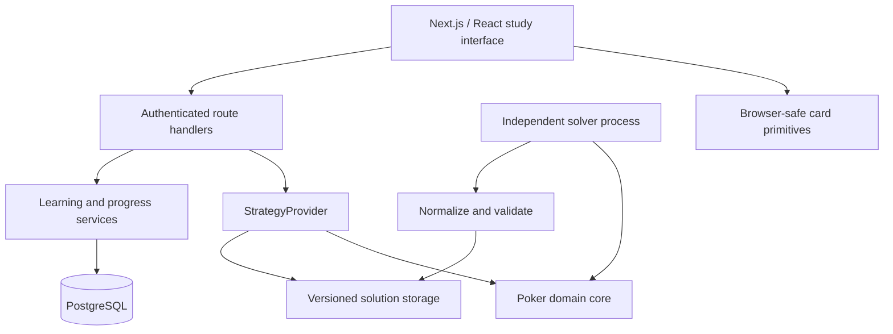

# Architecture

Rangeform is a personal poker learning application with a path to a hosted SaaS. The first release completes one learning loop, backed by an independently computed three-card Kuhn poker solution. It is not an NLHE solver release.

## Boundaries

`src/domain` contains deterministic card and game rules without framework dependencies. `src/solver` performs computation outside the request path. `src/strategy` defines lookup and artifact validation, independent of UI and persistence. `src/server` owns authentication, SQL persistence, learning services and request policy. Route handlers are thin transport adapters. `src/shared/contracts.ts` is the public browser-safe response contract. Browser components receive training questions without solver answers; the server evaluates decisions.

## Technology decisions

- Next.js App Router, React, strict TypeScript. Native CSS tokens and self-hosted Manrope avoid runtime font and UI-service dependencies.
- PostgreSQL SQL migrations and the `pg` driver for hosted environments. For an immediately runnable single-user development setup without Docker, PGlite runs the PostgreSQL engine in-process and persists to `.data/postgres`. Production requires `DATABASE_URL`; an explicit local-preview override is not a supported hosted architecture.
- Local immutable JSON artifacts for the small initial solution. Store source, algorithm version, rules/configuration hashes, iterations and independently measured exploitability. A storage adapter boundary allows S3-compatible storage later.
- No Redis or paid queue in the initial milestone. The bounded solver is a separate CLI process; durable jobs and worker states are separate from the web interface. Hosted orchestration requires a lease-based worker queue before running paid/on-demand jobs.
- Vitest for domain, solver and SQL/service integration. Playwright and axe for complete browser flows, semantic accessibility and responsive screenshots.

## Data model

Users have stable UUID identities, unique normalized email, password verifier, display name, experience and weekly study goal. Sessions hold a hash of a high-entropy bearer token and expiry, never its plaintext value. Lesson completion belongs to a user and lesson, with uniqueness preventing duplicate rewards. Training decisions belong to a user and immutable solution version; attempt identifiers make retries idempotent. Dashboard aggregates are derived from stored records rather than client counters. Rate-limit state is durable and bounded. See SQL migrations for the implemented fields and constraints; do not treat this description as a replacement for them.

The long-term model adds courses/modules/chapters, lesson revisions, versioned trainer spots, solution/node indexes, solver jobs, subscriptions, feature flags and recommendation history. Those additions are intentionally not represented by empty screens in this release.

Local access now uses a real seeded development account, never a bypass. The account carries a database flag that excludes it from production authentication and sessions. A small fixed Academy course links to the existing original lesson, with stable course/lesson URLs. A trainer session has explicit start and completion screens; its answered decisions are persisted immediately. The current session position and summary live in the browser and restart on a page reload; saved decisions and lesson completion remain durable.

`scripts/local-db.ts` provides local setup, migrations, idempotent seed and explicit reset. It loads the same development environment files as Next.js and refuses production or `DATABASE_URL`. A process lock prevents the local CLI and web app from opening the same PGlite directory together. Hosted PostgreSQL remains separate.

## Security and deployment boundaries

Session cookies are HttpOnly with SameSite policy and Secure over production HTTPS. Server authorization and same-origin checks protect writes. Password hashing is scrypt with individual salts. Queries use parameters; inputs are validated and bounded. Account data is private and never included in source control. Account export/deletion support personal data control. There are no trackers, payment requests, real-money tables or gambling referrals.

The host must supply HTTPS, a single canonical origin, database TLS, backups and operational monitoring. Production error collection is a deployment requirement, not a fictional integration. Health responses distinguish actual checks from unconfigured services. See `operations.md` and the status document for readiness limits.

## Future scaling path

Web app → node-scoped Strategy API → cache keyed by solution ID/version/node → object storage. PostgreSQL keeps metadata and indexes, not billions of strategy rows. Workers claim durable queue jobs, compute on separate CPU/GPU infrastructure, validate convergence and artifact integrity, then publish immutable versions atomically. Compression and binary formats must be chosen using representative benchmarks. Never load an entire industrial solution to answer one node request; the small Kuhn artifact is deliberately bounded to twelve information sets.

## Sources checked for implementation

- [Next.js installation and App Router documentation](https://nextjs.org/docs/app/getting-started/installation)
- [PGlite persistence and supported filesystems](https://pglite.dev/docs/filesystems)

Accessed 2026-09-06. Versions are locked in `pnpm-lock.yaml`.
