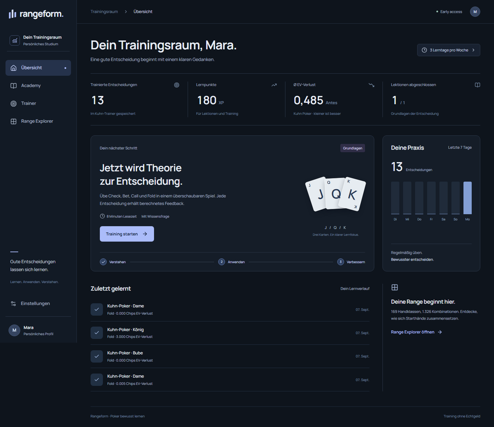
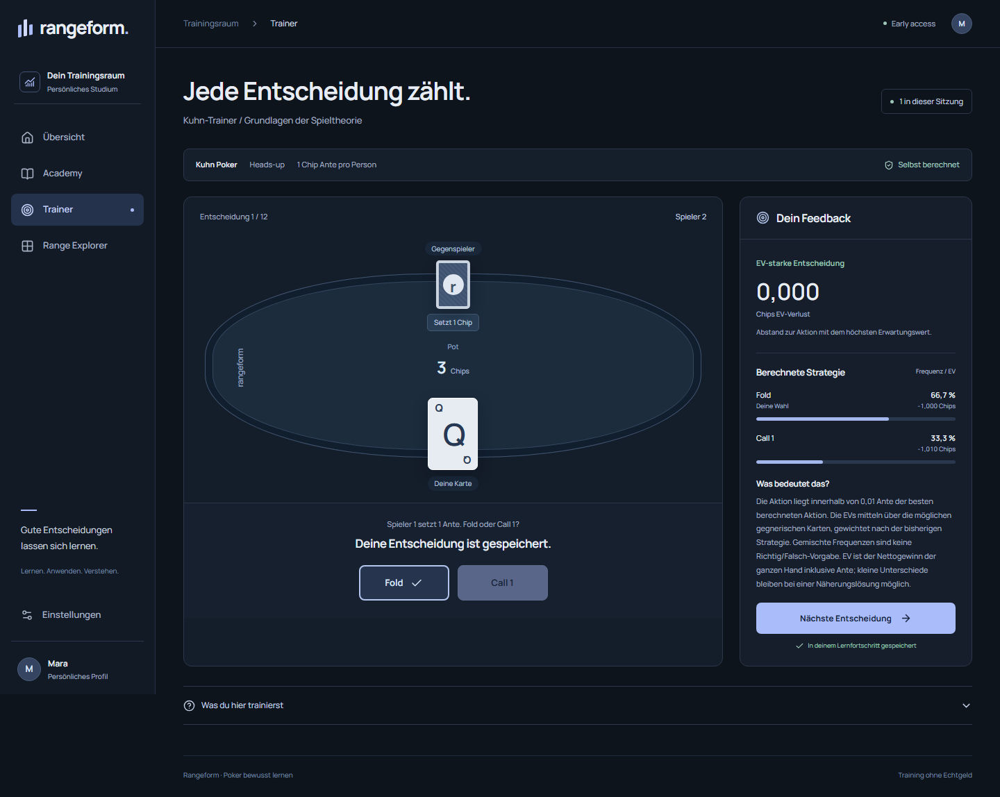
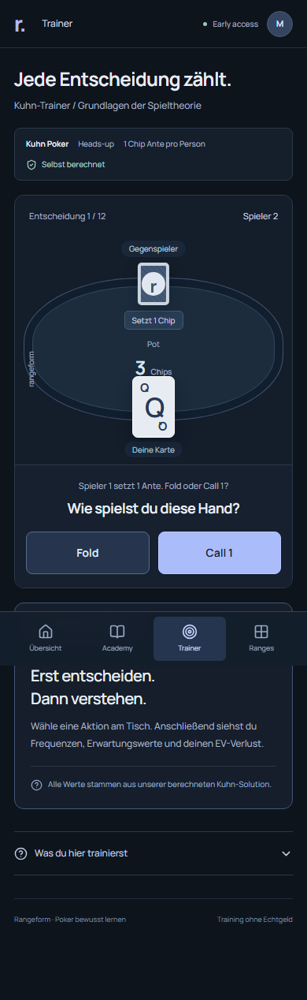
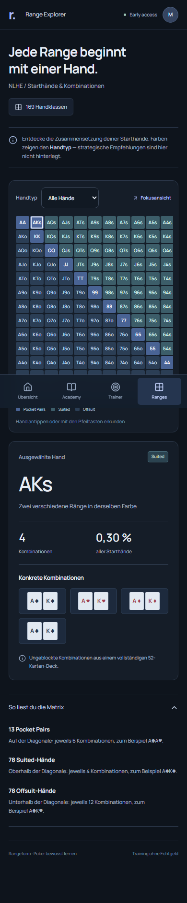

# Learning foundation — acceptance evidence

For the current NLHE application, see [NLHE study — acceptance evidence](nlhe-acceptance.md). [Local development access](local-access.md) records the preceding authentication milestone. The screenshots and totals below cover the historical Kuhn foundation, not the current user-facing trainer.

Verified locally on **2026-09-07**, Windows, Node 24.19.0, locked dependencies, Next.js production build and Playwright Chromium. Screenshots contain synthetic test accounts only.

## Executed checks

| Gate | Observed result |
| --- | --- |
| `pnpm typecheck` | Passed, strict TypeScript |
| `pnpm lint` | Passed |
| `pnpm test` | 47 passed; 1 skipped because local `TEST_DATABASE_URL` was not supplied |
| `pnpm build` | Passed; all implemented routes built |
| `pnpm test:e2e` | 3 passed, including the complete learning flow |
| GitHub PostgreSQL 16 acceptance | 35 domain/solver + 13 server integration + 3 browser tests passed; typecheck, lint and build passed |
| Accessibility | Zero axe WCAG 2 A/AA and 2.1 AA violations on dashboard, trainer and ranges at 390px and 1440px |
| Responsive overflow | Passed on dashboard, trainer and ranges at 320, 375, 390, 430, 768, 1024, 1280, 1440 and 1920px |
| Private GitHub access | Repository metadata confirms pull/push; project commits persisted through authenticated GitHub integration |

The GitHub workflow repeats the gates on Ubuntu with **PostgreSQL 16**. It supplies the skipped local database test and exercises the same browser journey through the real PostgreSQL adapter. Current revision results and downloadable reports are attached to [PR #1](https://github.com/mankenntmich3/poker-learning-platofmr/pull/1). Reports/traces are retained for 14 days; representative screenshots below are permanent repository artifacts.

Recorded successful PostgreSQL run: [34135665830](https://github.com/mankenntmich3/poker-learning-platofmr/actions/runs/34135665830), application revision `4ff468c3dc20c529a6933452cec9495e057d9434`. Subsequent tooling/documentation commits rerun the same workflow.

## Acceptance exercised

- Register a new account; observe a real empty dashboard.
- Answer the lesson quiz incorrectly and then correctly; save completion once.
- Make a decision without seeing solver answers first; receive computed frequencies, conditional EV and EV loss.
- Navigate and evaluate all twelve information sets, then return to the first question.
- Lose a response after a decision is saved, retry the same attempt and verify the stored total does not increase twice.
- Refresh, leave and return; verify saved lesson and decision counts.
- Inspect concrete hand combinations; use arrow keys, hand-type filters and focus view on mobile.
- Change name and weekly goal; log out and log in; verify account settings and progress persist.
- Exercise account isolation, forbidden origins, illegal actions, stale solution versions, conflicting attempt IDs, export and account deletion through the HTTP boundary.
- Inject a failed session request and recover with the visible retry control. No uncaught browser page errors in the complete flow.
- Unit/integration coverage includes game rules, card counts/blockers/suit equivalence, chip conservation, solver convergence against an analytic equilibrium, independent best responses, conditional EV, semantic artifact tampering, immutable publication, worker failure/deduplication/locking, SQL persistence after reopen and authentication.

Browser tests always start their own server and use either the isolated `.data/e2e-postgres` directory or an explicit `TEST_DATABASE_URL`. They never reuse a running app or inherit `DATABASE_URL`. `localhost` is used consistently so the request client and Chromium both retain the production Secure session cookie on loopback.

## Visual evidence

Reviewed the screenshots for layout, hierarchy, text wrapping, contrast, action visibility and navigation. Mobile decision buttons fit above the fixed navigation at 390 × 844. The compact range matrix scrolls inside its region; the separate inspector and focus view remain usable.

| Mobile trainer | Mobile hand explorer |
| --- | --- |
|  |  |

## Scope of this evidence

This is an acceptance record for a personal learning foundation. Chromium coverage is not Safari/Firefox/device certification; automated accessibility checks are not a full assistive-technology audit. Hosted TLS, recovery, security/load testing, email delivery and commercial readiness remain open in [project status](../PROJECT_STATUS.md).

The measured strategy is Kuhn poker only: source `COMPUTED`, solver `kuhn-full-tree-cfr/1.0.0`, immutable version `cfr1-100000-e359ca83dfee`, 100,000 iterations and independently measured exploitability **0.0006762196802849174 ante/hand**. No NLHE solver accuracy is claimed.
