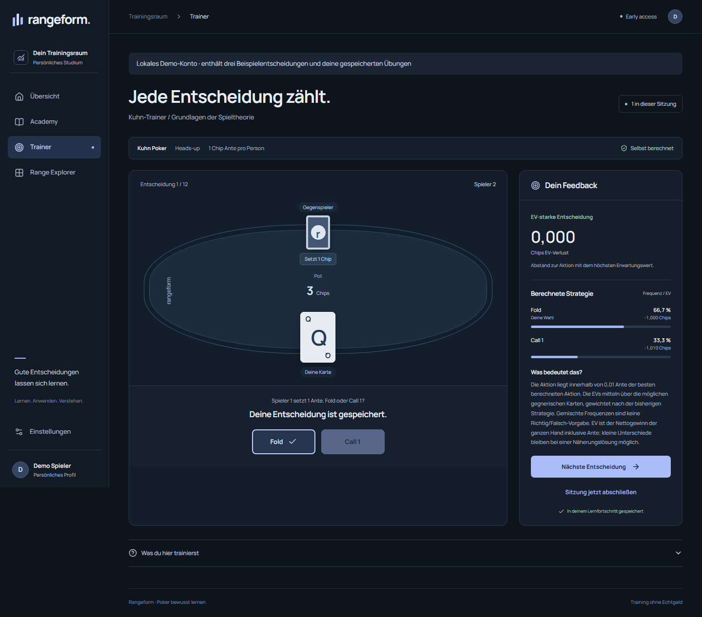
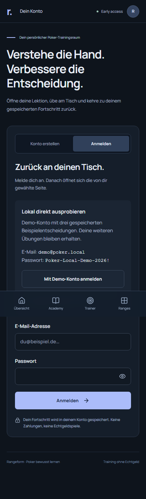
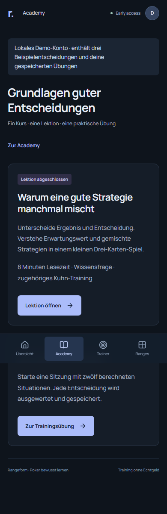
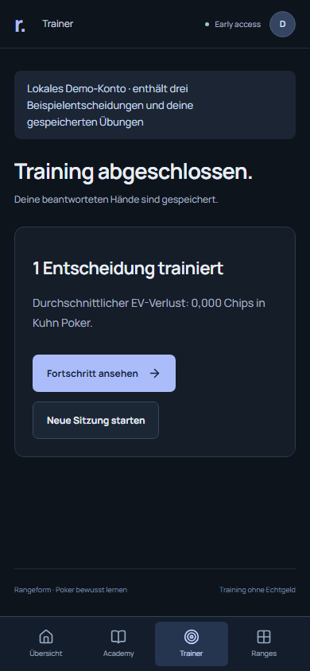

# Local development access — acceptance evidence

Verified 2026-09-07–08 on Windows, Node 24.19.0, pnpm 10.28.2 and Chromium. This is the acceptance record for making the existing product accessible locally. Screenshots contain only the explicitly seeded development account.

## What was broken

Authentication was already real: scrypt password verification, database-backed users and hashed session tokens, with HttpOnly cookies. It was neither a mock nor a UI-only login. The development server could canonicalize `localhost` to `127.0.0.1`, making valid same-origin login requests fail with HTTP 403. Protected routes showed registration in place, there was no demo seed, and the trainer had no explicit session start/completion. Early clicks during initial session loading could also disappear before the page was ready.

Development now validates literal loopback host/origin pairs; production keeps its configured-origin policy. Protected routes redirect to login with an allowlisted return destination. Login confirms that the browser retained its session before navigating, and logout starts a fresh document. Forms wait until they can handle input. A development-only database flag gates demo login and sessions; no authentication bypass exists.

## Clean checkout proof

The isolated checkout started at `e00a55baba5154abf7ed8216d76391e7b6ac607b`, verified identical to the private GitHub branch head. It was created with `git clone --no-local` using the local repository as transport because this workstation's native Git had no GitHub credential. Repository read/write and the exact remote commit were verified through the authenticated GitHub integration. No source, dependencies, environment file or database was copied outside Git. Before setup, `node_modules`, `.env.local` and `.data` were all absent.

The documented commands were executed in that checkout:

```sh
pnpm install --frozen-lockfile
pnpm db:setup
pnpm db:migrate
pnpm db:seed
pnpm dev
```

`db:setup` created `.env.local` and the default `.data/postgres` database from scratch. No manual environment changes or external database were needed. This verification used the normal server on `http://localhost:3000`, not an in-memory service or a mocked authentication provider.

The real Chromium browser personally exercised:

1. Visit the protected dashboard while logged out; arrive at login.
2. Enter `demo@poker.local` and the documented development password; reach the dashboard with exactly three sample decisions and an incomplete lesson.
3. Open Academy, the Grundlagen course and its lesson. Read the content and submit the quiz answer.
4. Follow **Am Tisch anwenden**, start a session and receive an actual Kuhn decision.
5. Submit Fold, see the independently computed strategy feedback and explicitly complete the session.
6. Refresh the dashboard: exactly four saved decisions and the completed lesson.
7. Log out, enter the credentials again and confirm the same stored progress. No uncaught browser page errors.

The server was then stopped, the demo was reseeded without losing progress, and the server restarted. A fresh browser login still observed four decisions and the completed lesson. Attempting to seed while the app owned the database was rejected with an actionable instruction to stop it first.

The documented `pnpm db:reset --confirm`, `pnpm db:migrate` and `pnpm db:seed` sequence also succeeded. After reset, a fresh browser login observed exactly three sample decisions and an incomplete lesson. The checkout was fast-forwarded to `c0f02f79fbc32b5deac90f75d44cf15f27b5022e` (mobile indicator/count polish); the complete browser flow passed again and produced the screenshots below.

## Automated gates

| Gate | Observed result |
| --- | --- |
| Strict typecheck and lint | Passed |
| `pnpm test` | 51 passed locally: 35 domain/solver + 16 server; 1 external PostgreSQL test skipped locally |
| Production build | Passed, including course and lesson routes |
| Production browser suite | 3 passed: complete personal learning flow, protected data/recovery, mobile accessibility/responsiveness |
| Development browser suite | 4 passed: signup, full demo learning flow, both loopback addresses/protected destinations, mobile access |
| GitHub PostgreSQL 16 | 35 domain/solver + 17 server + 3 production browser + 4 development browser = **59 passed** |

Recorded successful access implementation run: [34160222732](https://github.com/mankenntmich3/poker-learning-platofmr/actions/runs/34160222732), commit `e00a55baba5154abf7ed8216d76391e7b6ac607b`. The final application revision `c0f02f79fbc32b5deac90f75d44cf15f27b5022e` also passed every CI gate in [run 34186760153](https://github.com/mankenntmich3/poker-learning-platofmr/actions/runs/34186760153). Typecheck, lint, all local unit/integration tests and build were repeated successfully on that revision. Documentation-only follow-up checks are attached to [PR #1](https://github.com/mankenntmich3/poker-learning-platofmr/pull/1).

Coverage includes wrong/correct quiz answers, all twelve training decisions and explicit completion, idempotent decision retries, saved progress after relogin, logout/deep-link return, expired sessions, account isolation, hostile origins and rejected open redirects. Production checks reject demo registration/login/existing sessions and exclude demo credentials from rendered pages. Seed is idempotent, preserves later progress and refuses non-development or hosted databases. PGlite tests cover active-owner rejection and dead-owner recovery.

Reproduce the dedicated local-access suite with `pnpm test:dev-access` after installing Chromium and stopping the normal dev server. It creates an isolated database, runs setup/migrations/seed and starts its own development server on port 3100. The production suite uses its own isolated database or the explicit CI PostgreSQL URL. Neither suite uses personal learning records.

## Reviewed screenshots

Reviewed text, action visibility, wrapping, mobile navigation and feedback. The development overlay no longer covers mobile navigation. Full-page captures show the fixed navigation at the bottom of the original viewport; the page remains scrollable below it.



| Development login | Course with stored completion | Finished training |
| --- | --- | --- |
|  |  |  |

## Deliberate limits

One coherent course/lesson and twelve Kuhn situations are usable. Kuhn is a three-card toy game, not an NLHE solution. Answered decisions and lesson completion are durable; the current session position/summary restarts on reload. The demo is available with `pnpm dev` and the local database only. Chromium and automated accessibility coverage do not replace other-browser, device or assistive-technology audits. Hosted deployment, password-reset/email delivery and commercial readiness remain separate future work.
