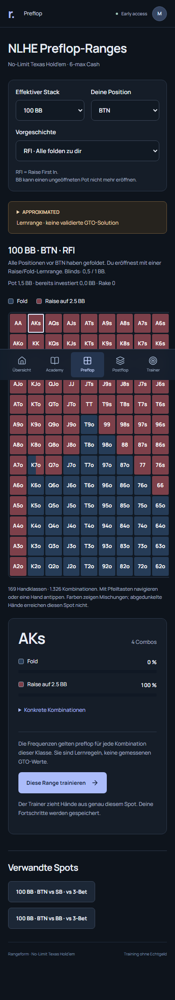
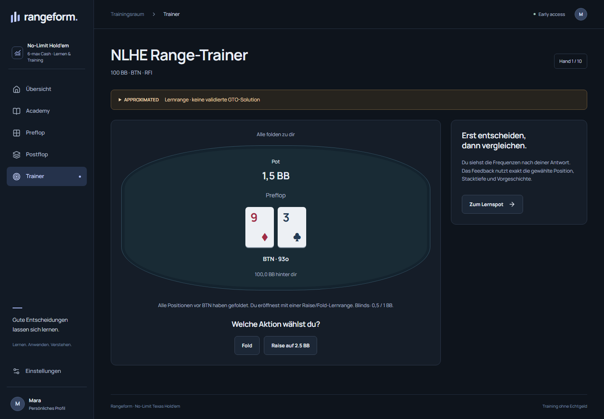

# NLHE study — acceptance evidence

Verified locally on 2026-09-09 with Node 24.19.0, pnpm 10.28.2, locked dependencies, Windows and real Chromium. Application revisions: `f35130f8de2a93bb96c2903fbe93f3508c6220d7` (fresh-checkout flow) and `cd157c0386461e1c17cc9c744bea029d431a0fbb` (rapid range selection fix). This record supersedes the Kuhn-facing screenshots and test totals in older QA notes.

## Executed gates

- Strict typecheck and lint passed.
- `pnpm test`: 67 passed, one external PostgreSQL case skipped locally.
- `pnpm build`: passed with all implemented pages and API routes.
- `pnpm test:e2e`: all three production Chromium scenarios passed. The NLHE journey covers Academy/quiz, ten actual Hold'em decisions, feedback, explicit completion, a second new session, lost-response retry without duplicate progress, logout/relogin and retained records.
- `pnpm test:dev-access`: five scenarios passed in a freshly cloned, GitHub-identical checkout after frozen dependency installation. The suite creates environment/database, applies migrations and seeds the development demo before starting Next.js. It covers personal signup, exact selected range, every requested stack/position, custom depth, fixed flop/blockers, mobile keyboard operation, feedback and persisted progress.
- Filesystem integration closes and reopens the actual local database and verifies the same NLHE question, feedback, account session and progress. The original sample fixture is explicitly labelled as an example.
- Eight axe WCAG 2 A/AA and 2.1 AA scans passed on dashboard, trainer, ranges and postflop at 390 and 1440 pixels. Horizontal page overflow checks passed at nine widths from 320 to 1920 pixels. The mobile matrix scrolls within its own container and supports arrow-key navigation.

The first GitHub run passed the real PostgreSQL and production browser gates but exposed a race during rapid successive range selections. The fix uses the current URL and Next.js's supported native history integration, avoiding asynchronous server navigation for client-side filters. The existing regression now also delays server navigation; it passed locally, as did the repeated production build/browser suite. GitHub run [34398395517](https://github.com/mankenntmich3/poker-learning-platofmr/actions/runs/34398395517) **passed every gate**: 44 domain/solver tests, 24 server tests including real PostgreSQL 16, three production browser scenarios and five development scenarios, plus typecheck, lint and production build. PR #2 was merged as `a408c2981bf25b43d08c134b87f0a4f9fac3e1a2`. Staging deployment and Neon 18 acceptance are tracked separately in [staging](../staging.md).

## Data and limits

All initial NLHE frequencies are original APPROXIMATED learning rules. Immutable policy `nlhe-approx-v1-34a10890a8dd` passes 386 structural/legality context checks, not an equilibrium-accuracy test. No GTO, exploitability or EV regret is claimed. The bounded postflop spot is 100 BB BTN vs BB, A♠ 7♦ 2♣, check or bet 1.8 BB. Chromium/axe does not replace a screen-reader audit or physical-device testing.

The separate fresh checkout started without dependencies, environment files or database files. Its origin is the private GitHub repository; objects were cloned from the verified identical local commit because authenticated Git transport is unavailable in this environment. No hosted secrets or real user records were copied. A further live-browser pass completed demo login → Academy → course → lesson/quiz → NLHE hand → action/feedback → session completion → logout/relogin. A separate server invocation reran migrations/seed, logged in again and verified the exact decision total, completed lesson and completed session URL. Both passes succeeded.

## Visual evidence

Screenshots contain synthetic test accounts only. The matrix has an inner horizontal scroll area on narrow screens; the page itself does not overflow.

