# Solver architecture

## Implemented scope

The first worker solves **standard two-player Kuhn poker**, a deliberately small imperfect-information game. It proves the complete strategy production and training path. It supplies **no NLHE preflop or postflop GTO strategies**. The Hold’em 169-class range explorer is a card-combinatorics learning tool, not an NLHE strategy dataset.

Rules are fixed in `src/solver/kuhn.ts`: three cards J < Q < K, one private card per player, both ante one unit, one unit bet, at most one bet and a call or fold. Chance uniformly enumerates all six distinct ordered deals. The first player acts first; there are four public decision histories and twelve information sets. A check showdown pays ±1 net ante, a called bet ±2, and a fold gives the bettor +1. The game is zero-sum, without rake.

```mermaid
flowchart LR
  C[Fixed game configuration] --> T[Enumerated legal game tree]
  T --> J[Durable local job]
  J --> W[Separate CLI CPU worker]
  W --> S[Full-tree CFR]
  S --> N[Average strategy normalization]
  N --> V[EV, best-response and integrity validation]
  V --> A[Immutable solution object]
  A --> I[Atomic published index]
  I --> P[StrategyProvider]
  P --> API[Server evaluation]
  API --> UI[Kuhn trainer]
```



## Solver and independent accuracy

`solveKuhn(iterations)` implements deterministic, simultaneous-update counterfactual regret minimization. Every iteration freezes the current regret-matched policy, traverses all chance deals, accumulates counterfactual regrets with opponent/chance reach, and then updates all regrets together. Positive regret matching chooses the next policy; zero positive regret uses a uniform policy. Average policies are accumulated with the acting player's own reach probability. Export normalizes those average policies rather than the last iteration's policy.

The algorithm follows the counterfactual regret framework in [Zinkevich, Johanson, Bowling and Piccione, *Regret Minimization in Games with Incomplete Information*, NeurIPS 2007](https://papers.nips.cc/paper_files/paper/2007/hash/08d98638c6fcd194a4b1e6992063e944-Abstract.html). This repository contains its own implementation and self-generated data.

`src/solver/best-response.ts` independently evaluates all 64 deterministic information-set policies for **each** player against the exported opposing policy. Its evaluator uses separately written terminal formulas and does not call the CFR traversal. A best response shares each action across indistinguishable deals and therefore cannot cheat by observing the opponent's private card.

For this zero-sum game:

```text
NashConv = BR_value(player 0) + BR_value(player 1)
exploitability = NashConv / 2
```

The publication threshold is **0.005 ante per hand** exploitability. Iteration count is reported but never substituted for accuracy. An independently specified analytic equilibrium fixture checks both best-response values and the known game value −1/18. A uniform policy must be identified as exploitable. The computed 100,000-iteration artifact has:

| Measure | Actual result |
| --- | ---: |
| Information sets | 12 |
| Expected payoff, player 0 | −0.05555470109818003 ante/hand |
| Exploitability | 0.0006762196802849174 ante/hand |
| NashConv | 0.0013524393605698348 ante/hand |
| Recorded computation time | 893 ms on the initial local run |

This is a numerical approximation to equilibrium. It is not advertised as an exact equilibrium or as evidence of NLHE solving capacity.

## Conditional action EV and training

`conditionalActionValues` accepts the player's own card and public history only. For each still-possible opponent card it multiplies the prior by the opponent's policy reach through that history, normalizes these weights, and evaluates each forced action with subsequent play following the average policy. The player's earlier choices cancel in the conditional beliefs because they are identical across the opponent cards at the information set. Zero opponent reach is rejected because the conditional EV would be undefined.

Example at the analytic equilibrium: holding Q after an opening bet, J bets with probability 1/3 while K bets with probability 1. The posterior is therefore 1/4 J and 3/4 K. Calling has EV `(1/4 × 2) + (3/4 × −2) = −1`, matching folding. Uniformly averaging the two cards would incorrectly produce zero. A regression test covers this distinction.

Training regret is `max(action EV) − chosen action EV`, in net ante per hand, including money already contributed. Choosing a less frequent action in a mixed strategy is not automatically an error. The UI's explanatory 0.01-ante tolerance is a learning convention, distinct from the globally measured exploitability. Responses retain the exact solution ID/version for reproducibility.

## Durable worker and storage

Run the worker independently of the web process:

```sh
pnpm solve
pnpm solve 100000
```

With no iteration argument, the CLI revalidates the currently published solution and exits, or computes the default if no index exists. An explicit count routes through `runSolverJob`. The job ID hashes game configuration, solver version and iteration count. Completed jobs return their validated immutable artifact; matching existing indexed data can be adopted without replacement. A per-job exclusive `.lock` file prevents simultaneous workers from owning the same job.

Current job metadata is written under `data/solutions/jobs/` through `queued → running → validating → completed`, or `failed`. JSON metadata updates use flushed temporary files followed by atomic rename. Failed validation never updates the published index. Existing published solutions survive subsequent failed jobs. The CLI is the local CPU worker; the web app does not pretend to schedule a distributed queue.

Artifact publication validates first, writes/flushed a unique temporary file, then creates an atomic hard link to the final immutable filename. An existing filename cannot be overwritten. The published index changes only after object publication succeeds. This adapter targets a local filesystem with hard-link support; S3 needs its own conditional object-put implementation. These guarantees do not substitute for backups, filesystem durability guarantees, or an object-storage disaster recovery plan.

After a process crash, inspect the job and confirm that its recorded worker PID is no longer running before removing a stale lock and retrying. Automatic stale-lock stealing, checkpoints, cancellation, priority scheduling, distributed leases, cost accounting and GPU work are not implemented. Current jobs are small enough to restart from iteration zero. No web endpoint triggers expensive arbitrary solver input.

## Domain boundary and future adapters

`StrategyProvider` in `src/strategy/types.ts` defines `getNode`, `getComboStrategy`, `getRangeStrategy`, `getActionEVs`, `getNextNodes`, and `hasSolution`. `StaticDatasetProvider` is backed by validated immutable artifacts; user-facing code calls the server facade in `src/strategy/index.ts`, whose API contract is `src/shared/contracts.ts`. Missing NLHE configurations explicitly return unavailability. Returned nodes are copies and cannot mutate cached policy data.

The provider/storage boundary supports future database indexes, object storage and licensed or computed solutions. Future game engines must define their own full state/configuration, legal tree, convergence method and provenance. The current worker deliberately does not claim external solver, CFR+, DCFR, MCCFR, subgame, GPU or full NLHE implementations.

The Hold’em domain independently provides 52 cards, 1,326 unordered concrete combos, 169 aggregated starting-hand classes, card removal, global suit canonicalization, coarse board-texture tags and integer chip accounting. The chip ledger is an accounting primitive: it does not implement a complete NLHE betting engine or side-pot settlement.

## Verification

`tests/domain/` validates cards, multiplicities, blockers, all 24 global suit permutations, inverse suit mappings, chronological group boundaries, chip conservation and pot odds. `tests/solver/` validates game transitions/payoffs, deterministic convergence, independent best responses, conditional EV, artifact corruption, semantic tampering, immutable reload, provider unavailability, answer-free training prompts, server evaluation, fresh job execution, deduplication, failed publication and lock exclusion. Run `pnpm test:unit`, `pnpm typecheck`, and `pnpm lint`.
